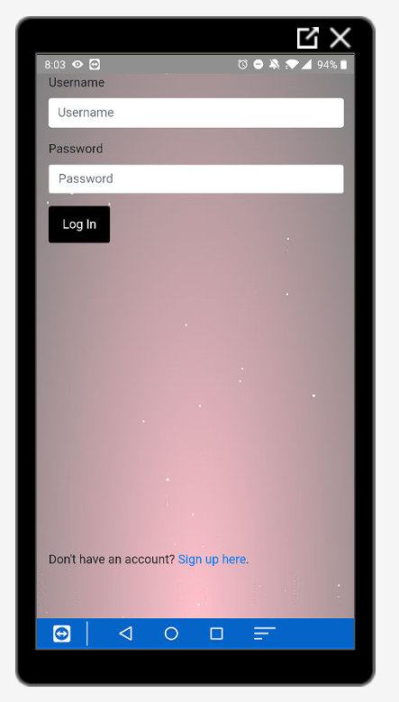

# **Wellness Journey** 

Full-stack application designed to help users develop positive thinking and behaviors through motivational videos and journal entries. 

## [Try it yourself!](https://wellnessjourney.herokuapp.com/login)

## Or you can watch the demo video [here](https://drive.google.com/open?id=18y1c42mFzwOQfzSe4IjqgzeSDtKhYxJd)

## Built With

- [Heroku](https://www.heroku.com/) - Cloud Application Platform
- [MongoDB](https://www.mongodb.com/) - NoSQL Database
- [Flask](https://palletsprojects.com/p/flask/) - Web Application Framework
- [jQuery/Ajax](https://jquery.com/) - Front-end framework 
- [Bootstrap](https://getbootstrap.com/) - Front-End Framework
- [D3](https://d3js.org/) - API calls
- [Plotly](https://plotly.com/python/) - Graphing
- [GoNative](https://gonative.io/) - Application Wrapper

## Planned Updates

This app is still being developed, and is not yet at minimum viable product status.

What needs to be added:
- Scheduled emails for goal reminders
- Database restrictions
- UI improvements
- User authentication improvements
- Automatic posts to instagram
- Machine learning - find trends between mood and entry
- Access to liked videos
